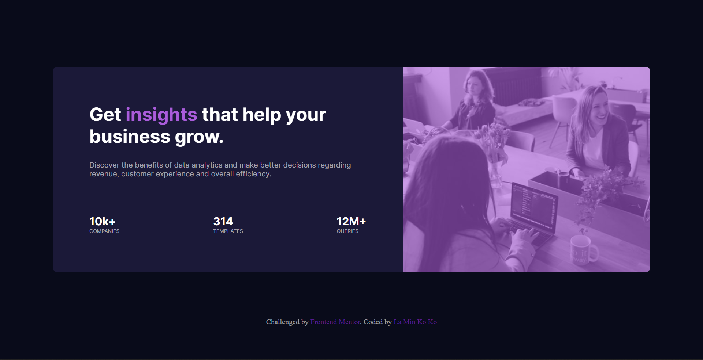

# Frontend Mentor - Stats preview card component solution

This is a solution to the [Stats preview card component challenge on Frontend Mentor](https://www.frontendmentor.io/challenges/stats-preview-card-component-8JqbgoU62). Frontend Mentor challenges help you improve your coding skills by building realistic projects. 

## Table of contents

- [Overview](#overview)
  - [The challenge](#the-challenge)
  - [Screenshot](#screenshot)
  - [Links](#links)
- [My process](#my-process)
  - [Built with](#built-with)
  - [What I learned](#what-i-learned)
- [Author](#author)
- [Acknowledgments](#acknowledgments)

## Overview

### The challenge

Users should be able to:

- View the optimal layout depending on their device's screen size

### Screenshot



### Links

- Solution URL: [Github](https://your-solution-url.com](https://github.com/laminkoko243/stats-preview-card-component)
- Live Site URL: [Github](https://your-live-site-url.com](https://laminkoko243.github.io/stats-preview-card-component/)

## My process

### Built with

- Semantic HTML5 markup
- CSS custom properties
- Flexbox

### What I learned

 - How to overlay a color to an image
 - Only work with rgba value when overlaying a color to an image.
 - flex-direction value '~-reverse'.
 - How to cover a div with image fully.

To see how you can add code snippets, see below:

```css
.header-col-2 {
        width: 100%;
        height: 200px;
        display: flex;
        justify-content: center;
        align-items: center;
        overflow: hidden;
    }

    .header-img {
        flex-shrink: 0;
    min-width: 100%;
    min-height: 100%
    }
```

## Author

- Website - [La Min Ko Ko](https://www.laminkoko.com)
- Frontend Mentor - [@klaminkoko243](https://www.frontendmentor.io/profile/laminkoko243)
- Twitter - [@laminkoko243](https://twitter.com/laminkoko243)
- Facebook - [@laminkoko243] (https://www.facebook.com/laminkoko243)
- LinkedIn - [@laminkoko] (https://www.linkedin.com/in/laminkoko/)
- Github - [@laminkoko243] (https://github.com/laminkoko243)

## Acknowledgments

 - Acknowledged to Aung Myint Ko Anamalai for giving a hand in finding an error.
